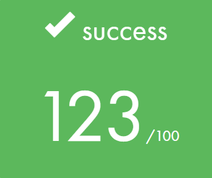

  

# wethinkcode_ Johannesburg

## get_next_line

GNL Project

This project is about creating a function that, allows to read a line ending with a newline character ('\n') 
from a file descriptor, without knowing its size beforehand. This was a great opportunity to understand how memory
leaks occur and how to use utilities such as valgrind (with debugging flags) to identify and stop leaks.

Concepts tested:
- Memory allocation
- Static variables
- Life cycle of a buffer

## Usage

This project relies on the libft library (self created replication of libc functions):
During compilation, the `-ggdb3` flag is used to provide debugging information for valgrind 

### A. Run basic tests

1. Run `bash compile.sh`. This will compiles `./libft/libft.a` and creates `./test_gnl` 
4. USAGE: `./test_gnl file_name` e.g. `./test_gnl ./tests/bible.txt`

### B. Run basic tests with valgrind

1. install valgrind on Linux
    - `sudo apt-get install valgrind`
2. Run `bash compile.sh`.
3. USAGE WITH VALGRIND: `bash run.sh && ./test_gnl file_name` 

Valgrind diagnostics will be saved in get_next_line/valgrind-out.txt
